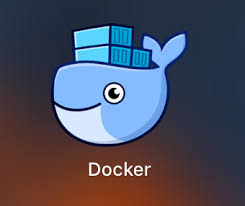

# Docker官方文档中文版+个人总结，仅供个人学习使用

`Docker`是一个用于开发，交付和运行应用程序的开放平台。

* [简介](Guides/get_started/docker_overview.md)
* [基础操作](basic/README.md)
    * [安装](basic/install.md)
    * [镜像](basic/image.md)
    * [容器](basic/container.md)
* [教程](guides/README.md) **官方**
    * [获取Docker](guides/get_docker.md)
    * [开始](guides/get_started/README.md)
        * [Docker简介](guides/get_started/docker_overview.md)
        * [快速开始](guides/get_started/quickstart.md)
        * [教育资源](guides/get_started/educational_resources.md)
    * [用Docker开发](guides/develop/README.md)
        * [简介](guides/develop/overview.md)
        * [最佳实践](guides/develop/best_practices.md)
        * [开发镜像](guides/develop/images/README.md)
            * [Dockerfile最佳实践](guides/develop/images/best_practices.md)
            * [创建基础镜像](guides/develop/images/base_image.md)
            * [构建增强](guides/develop/images/enhancement.md)
            * [多段构建](guides/develop/images/multi_stage_build.md)
            * [管理镜像](guides/develop/images/manage_image.md)
    * [网络配置](guides/network/README.md)
        * [网络简介](guides/network/overview.md)
        * [使用桥接网络](guides/network/bridge.md)
        * [使用覆盖网络](guides/network/overlay.md)
        * [使用主机网络](guides/network/host.md)
        * [使用macvlan网络](guides/network/macvlan.md)
        * [禁用网络](guides/network/disable.md)
        * [网络教程](guides/network/tutorials/README.md)
            * [桥接网络教程](guides/network/tutorials/bridge.md)
            * [主机网络教程](guides/network/tutorials/host.md)
            * [覆盖网络教程](guides/network/tutorials/overlay.md)
            * [macvlan网络教程](guides/network/tutorials/macvlan.md)
        * [Docker和容器配置](guides/network/configuration/README.md)
            * [Docker IPv6](guides/network/configuration/ipv6.md)
            * [Docker和防火墙](guides/network/configuration/iptables.md)
            * [容器网络](guides/network/configuration/container.md)
            * [代理](guides/network/configuration/proxy.md)
    * [管理应用数据](guides/storage/README.md)
        * [存储简介](guides/storage/overview.md)
        * [卷](guides/storage/volume.md)
        * [绑定挂载](guides/storage/bind.md)
        * [临时文件系统挂载](guides/storage/tmpfs.md)
        * [问题定位](guides/storage/troubleshoot.md)
        * [在容器内存储数据](guides/storage/within/README.md)
            * [存储驱动](guides/storage/within/drivers.md)
            * [选择存储驱动](guides/storage/within/select.md)
            * [aufs](guides/storage/within/aufs.md)
            * [btrfs](guides/storage/within/btrfs.md)
            * [设备映射](guides/storage/within/map.md)
            * [overlayFS](guides/storage/within/overlayFS.md)
            * [zfs](guides/storage/within/zfs.md)
            * [vfs](guides/storage/within/vfs.md)
    * [在生产环境运行您的应用](guides/production/README.md)
        * [编排](guides/production/orchestration.md)
        * [配置所有对象](guides/production/objects/README.md)
            * [将自定义元数据用于对象](guides/production/objects/metadata.md)
            * [修剪未使用的对象](guides/production/objects/prune.md)
            * [格式化命令并输出日志](guides/production/objects/format.md)
        * [配置守护进程](guides/production/daemon/README.md)
            * [配置并运行Docker](guides/production/daemon/docker.md)
            * [用Systemd控制Dokcer](guides/daemon/systemd.md)
        * [使用第三方工具](guides/production/external/README.md)
            * [第三方监控工具](guides/production/external/monitoring.md)
            * [使用Prometheus收集Docker指标](guides/production/external/prometheus.md)
        * [配置容器](guides/production/containers/README.md)
            * [自动启动容器](guides/production/containers/auto.md)
            * [在守护进程停机期间保持容器处于活跃状态](guides/production/containers/alive.md)
            * [在容器中运行多个服务](guides/production/containers/multi_services.md)
            * [容器运行时指标](guides/production/containers/metrics.md)
            * [运行时选项](guides/production/containers/runtime.md)
            * [日志](guides/production/containers/logging.md)
            * [安全](guides/production/containers/security/README.md)
                * [Dcoker安全性](guides/production/containers/security/docker_security.md)
                * [Docker非事件安全](guides/production/containers/security/non_events.md)
                * [保护Docker守护进程套接字](guides/production/containers/security/socket.md)
                * [使用证书验证存储客户端](guides/production/containers/security/certificate.md)
                * [使用受信任的镜像](guides/production/containers/security/trust.md)
                * [防病毒软件和Docker](guides/production/containers/security/antivirus.md)
                * [AppArmor的Docker配置文件](guides/production/containers/security/apparmor.md)
                * [Seccomp的Docker配置文件](guides/production/containers/security/seccomp.md)
                * [使用用户名称空间隔离容器](guides/production/containers/security/remap.md)
                * [以非root用户启动Docker守护进程](guides/production/containers/security/rootless.md)
            * [Swarm](guides/production/containers/swarm.md)
            * [插件](guides/production/containers/plugin.md)
* [数据管理：卷与挂载](guides/storage/README.md) **官方**
* [网络管理](guides/network/README.md) **官方**
